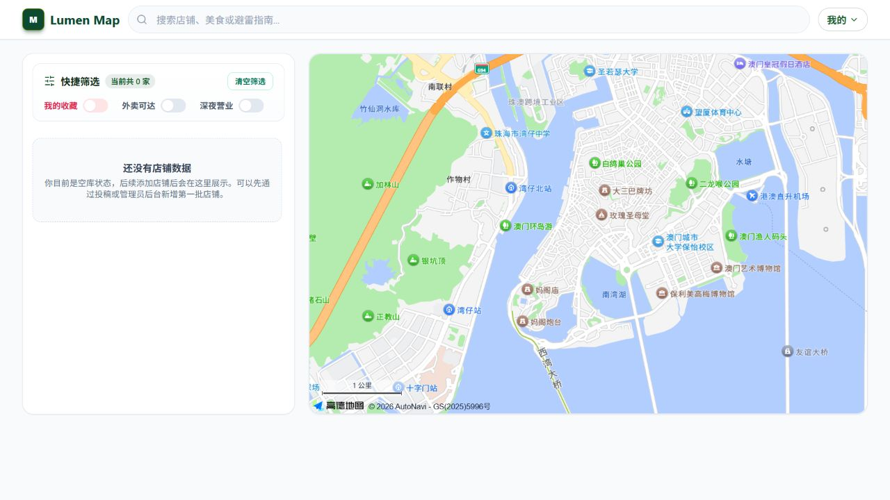
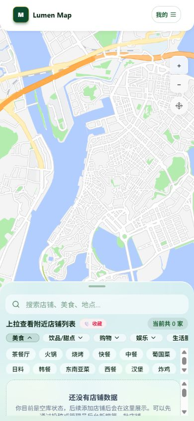
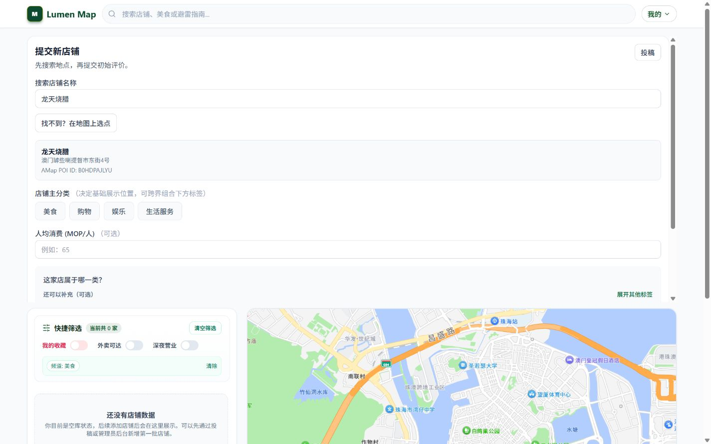

# Macau Student Map

面向澳门学生的本地生活信息地图，用于探索餐饮及校园周边生活地点。

A local-life map for students in Macau to discover food and useful places around campus.

## Project Overview

I started this personal project because I wanted a simpler way for students in Macau to find restaurants and other useful places near their campuses. The project turns that idea into an online Web application where users can browse a map, search by names or tags, save places, share reviews, and contribute new location information.

The project is an actively developed student prototype rather than a mature commercial product.

## Demo

[https://macau-student-map.vercel.app/zh-CN](https://macau-student-map.vercel.app/zh-CN)

## Screenshots

### Map homepage

### Search and filters

### Place contribution flow

The screenshots were captured from the current local build without a signed-in account or private user data.

## Features

- Map-based place discovery with markers, marker clustering, map selection, and geolocation
- Name, address, tag-alias, category, region, price, rating, and saved-place filtering
- Shareable search state through URL query parameters
- Simplified Chinese, Traditional Chinese, and English routes using next-intl
- Email OTP login for members, with a separate role-checked administrator login
- Place contribution workflow with drafts, duplicate-place checking, submission, and review status
- Client-side image compression followed by controlled Supabase Storage uploads
- Favorites, one rating/review per user and place, and confidence-aware rating display
- Administrator approval, duplicate merging, rejection, media management, and audit records

## Tech Stack

| Area | Technologies |
| --- | --- |
| Frontend | Next.js 15, React 19, TypeScript, Tailwind CSS, next-intl |
| Backend / Application | Next.js App Router, Route Handlers, Zod |
| Database / Auth / Storage | Supabase, PostgreSQL, Supabase Auth, Storage, Realtime, Row Level Security (RLS) |
| Map | AMap JavaScript API 2.0 |
| Testing | Vitest, ESLint, Supabase CLI and pgTAP database tests |
| Deployment | Vercel |

## Architecture

~~~text
Browser
  ├─> Next.js application
  │     ├─> React user interface
  │     └─> Next.js Route Handlers
  ├─> Supabase client / Data API
  │     ├─> PostgreSQL + Row Level Security
  │     ├─> Auth
  │     ├─> Storage
  │     └─> Realtime
  └─> AMap JavaScript SDK
~~~

The browser renders the React interface and loads the AMap SDK for map interactions. Public and authenticated data requests use the Supabase publishable/anonymous key, while database RLS policies enforce which rows each user can read or change. Next.js Route Handlers validate request data and user sessions for submission, review, upload, and moderation workflows.

## Project Structure

~~~text
app/                  Next.js pages, layouts, and API Route Handlers
components/           Map, search, place, contribution, review, and admin UI
lib/                  Domain rules, data mapping, search, auth, and services
messages/             Simplified Chinese, Traditional Chinese, and English text
supabase/migrations/  PostgreSQL schema, functions, RLS, and Storage policies
supabase/tests/       pgTAP database and security tests
tests/                Vitest unit and component tests
docs/                 Screenshots and project design notes
~~~

## Local Development

Requirements: Node.js 20 or later. Docker Desktop is only required when running the local Supabase database tests.

~~~powershell
git clone https://github.com/Aiden1810/macau-student-map.git
Set-Location macau-student-map
npm install
Copy-Item .env.example .env.local
npm run dev
~~~

Open [http://localhost:3000/zh-CN](http://localhost:3000/zh-CN).

Configure these values in **.env.local**:

| Variable | Purpose |
| --- | --- |
| NEXT_PUBLIC_SUPABASE_URL | Supabase project URL |
| NEXT_PUBLIC_SUPABASE_ANON_KEY | Supabase publishable/anonymous key |
| NEXT_PUBLIC_AMAP_WEB_KEY | AMap Web JavaScript API key |
| NEXT_PUBLIC_AMAP_SECURITY_CODE | Optional AMap security code, when enabled in the AMap console |

Variables prefixed with **NEXT_PUBLIC_** are included in browser code. Do not place a Supabase **service_role** key, administrator password, or another private secret in them.

Useful checks:

~~~powershell
npm run doctor
npm test
npm run lint
npm run i18n:check
npm run build
~~~

Local database tests can be run separately after Docker Desktop is available:

~~~powershell
npx supabase start
npx supabase db reset --local
npx supabase test db --local
~~~

## Current Status

**Personal Project / Prototype**

The application is deployed and usable for demonstrations, but it is still being iterated and should not be described as production-ready or enterprise-grade.

## Development Process

This project was developed with an AI-assisted workflow. I was primarily responsible for product ideation, requirement and feature planning, evaluating the interface, iterative testing, identifying problems, and making implementation decisions. AI coding tools were extensively used to assist with code generation, debugging, testing, and refactoring. I am now using the project as a structured way to strengthen my understanding of TypeScript, React, Next.js, databases, and Web engineering.

## Current Limitations / Future Improvements

- The application still supports both the canonical **places** model and the legacy **shops** model, which increases mapping and maintenance complexity.
- Search and ranking for the compatibility data path currently run mainly in the browser; larger datasets will need a clearer server-side search and pagination strategy.
- Simplified Chinese is the current iteration priority. Traditional Chinese and English routes exist, but new taxonomy and interface changes need a later consistency review.
- POI search covers Macau and Zhuhai, while strict server-side service-area and coordinate-boundary validation can be improved.
- Unit tests and database security tests exist, but end-to-end browser coverage and repeatable staging verification are still limited.

## Repository Notice

This is a public repository, but it currently does not include a license and is not presented as open source. All rights remain reserved by default.
